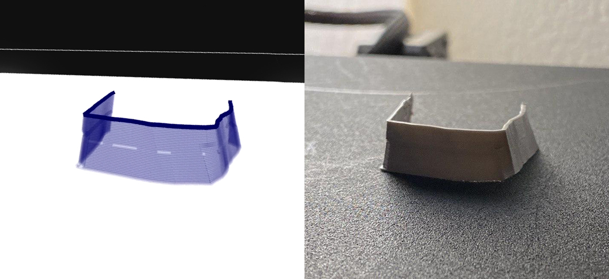
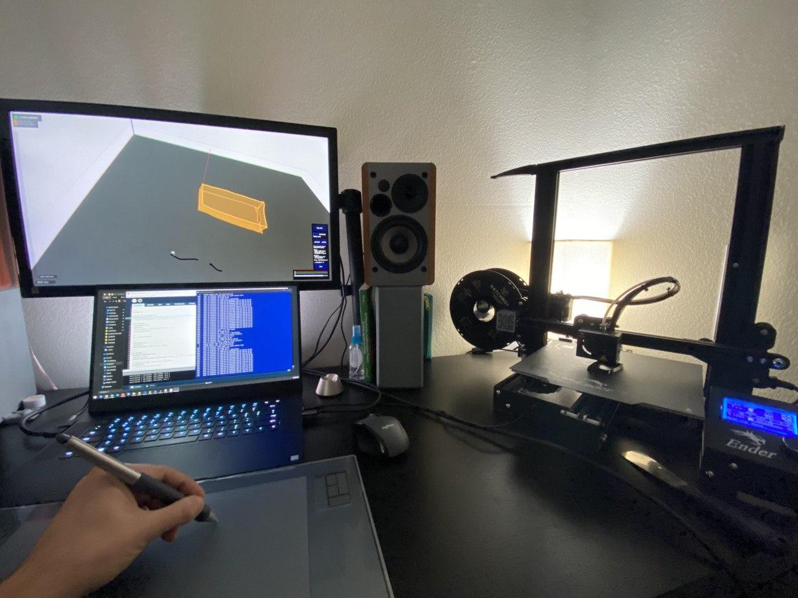

# Materializer: Interactive Drawing Interface for Digital Fabrication

*Materializer* is an interactive drawing system for 3D printing with direct user input. Its drawing interface allows users to sketch freely on 2D surfaces that stack on top of each other and create a 2.5D canvas. This software collects brush stroke information, and sends them to the [Python back-end](https://github.com/merttoka/materializer_backend) to communicate with Ender 3 Pro.

Originally intended to work on iPad using Duet Display but currently it is tuned for keyboard and mouse input.  

## Usage
The program starts with an empty canvas representing 3D printer bed. Mouse drag will rotate the view 
#### Interaction
| Key                           	| Description                                                                                                                 	|
|-------------------------------	|-----------------------------------------------------------------------------------------------------------------------------	|
| `space`                       	| Toggles between the "drawing mode" and "viewing mode"                                                                       	|
| `shift` + `mwheel`            	| Moves the active layer height up and down                                                                                   	|
| `lclick`                      	| (drawing mode) Draw on active layer                                                                                         	|
| `shift` + `lclick`            	| (viewing mode) Selects strokes                                                                                              	|
| `t`                           	| Top view                                                                                                                    	|
| `c` or `backslash`            	| Clear selected strokes                                                                                                      	|
| `i`                           	| Interpolates many strokes between two selected strokes to form a surface                                                    	|
| `s`                           	| Stop print task                                                                                                             	|
| **cp5.b** \| `move_up`/`down` 	| Changes the active layer                                                                                                    	|
| **cp5.t** \| `tweencount`     	| Number of strokes to be generated when interpolating. -1 forms a surface, any other number will generate loose components.  	|
| **cp5.b** \| `stroke`         	| Print on finishing the stroke. While this mode is on, your strokes will be sent to printer on finishing them.               	|
| **cp5.b** \| `selected`       	| Print only selected strokes using the `PRINT` button                                                                        	|
| **cp5.b** \| `print`          	| Print selected strokes                                                                                                      	|

## Future Work
- [ ] Align with the previous layer
- [ ] Infill
- [ ] Translate/Rotate strokes (3D printing)
- [ ] Nozzle collusion calculation (3D printing)
- [x] Print scheduler
- [x] Select multiple strokes

Dependencies (in `libraries` folder):
- oscP5
- PeasyCam
- ControlP5

*Tested on Windows 10 with Processing 3.5.3*
